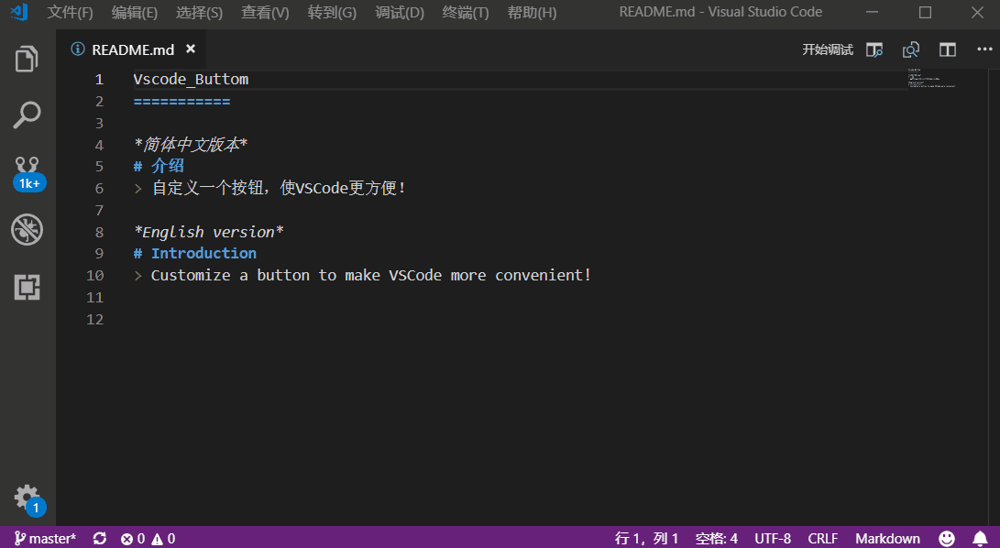
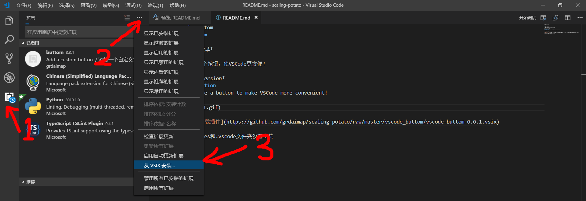

VSCode_Buttom
===========

## 介绍 Introduction
> 自定义一个按钮，使VSCode更方便！

> Customize a button to make VSCode more convenient!

## 动图

## [点击此处下载插件](https://github.com/grdaimap/scaling-potato/raw/master/vscode_buttom/vscode-buttom-0.0.1.vsix)

---------------------------

## 如何安装？

----------------------
## 其他注意事项

**node_modules和.vscode文件夹没有上传**
